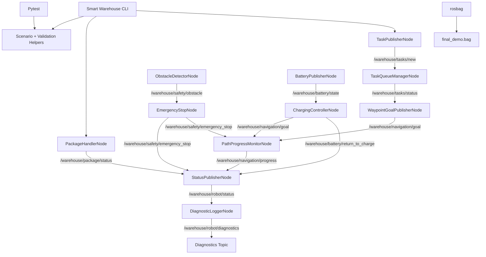

# Smart Warehouse Mobility Robot

A ROS 1 Noetic smart mobility project for simulating an autonomous warehouse robot.

This project demonstrates how a warehouse robot can receive tasks, convert them into navigation goals, simulate movement between warehouse zones, detect obstacles, trigger emergency stops, monitor battery state, return to the charging station, handle package pickup/dropoff, publish robot status, generate diagnostics, provide an advanced CLI, run pytest scenarios, and record ROS bag data.

---

## 1. Project Objective

The objective of this project is to design and implement a **Smart Warehouse Mobility Robot** using ROS 1 Noetic.

The robot simulates a real warehouse mobility workflow:

1. A warehouse task is created.
2. The task is queued and started.
3. A navigation goal is generated.
4. The robot moves between warehouse zones.
5. Safety monitoring detects obstacles.
6. Emergency stop can block navigation.
7. Battery monitoring detects low battery.
8. The robot can return to the charging station.
9. Package pickup/dropoff services simulate warehouse handling.
10. Robot status and diagnostics summarize the whole system.
11. Pytest validates the logic.
12. ROS bag records the demo topics.

---

## 2. Target Environment

This project is built for:

```text
Ubuntu 20.04
ROS 1 Noetic
Python 3
catkin
rospy
std_msgs/String
std_srvs/Trigger
pytest
click
rosbag
```

This project is **not ROS 2**.

Do not use:

```text
rclpy
ros2
ament
colcon
.launch.py
```

---

## 3. Main Technologies

| Technology | Purpose |
|---|---|
| ROS 1 Noetic | Robot middleware |
| rospy | Python ROS 1 node development |
| catkin | ROS 1 build system |
| std_msgs/String | JSON-based topic communication |
| std_srvs/Trigger | Package pickup/dropoff services |
| pytest | Automated scenario and logic testing |
| click | Advanced command-line interface |
| rosbag | Recording and replaying demo data |

---

## 4. Project Structure

```text
smart_warehouse_robot/
├── CMakeLists.txt
├── package.xml
├── setup.py
├── README.md
├── .gitignore
│
├── scripts/
│   ├── task_publisher_node.py
│   ├── task_queue_manager_node.py
│   ├── waypoint_goal_publisher_node.py
│   ├── path_progress_monitor_node.py
│   ├── obstacle_detector_node.py
│   ├── emergency_stop_node.py
│   ├── battery_publisher_node.py
│   ├── charging_controller_node.py
│   ├── package_handler_node.py
│   ├── status_publisher_node.py
│   ├── diagnostic_logger_node.py
│   ├── smart_warehouse_cli.py
│   ├── record_demo_bag.sh
│   ├── replay_demo_bag.sh
│   ├── check_demo_bag.sh
│   └── run_demo_instructions.sh
│
├── src/
│   └── smart_warehouse_robot/
│       ├── __init__.py
│       ├── cli.py
│       │
│       ├── common/
│       │   ├── __init__.py
│       │   ├── models.py
│       │   ├── constants.py
│       │   └── helpers.py
│       │
│       ├── services/
│       │   ├── __init__.py
│       │   ├── task_queue.py
│       │   ├── navigation.py
│       │   ├── safety.py
│       │   ├── battery.py
│       │   ├── package_handler.py
│       │   └── status.py
│       │
│       └── nodes/
│           ├── __init__.py
│           ├── task_publisher.py
│           ├── task_queue_manager.py
│           ├── waypoint_goal_publisher.py
│           ├── path_progress_monitor.py
│           ├── obstacle_detector.py
│           ├── emergency_stop.py
│           ├── battery_publisher.py
│           ├── charging_controller.py
│           ├── package_handler.py
│           ├── status_publisher.py
│           └── diagnostic_logger.py
│
├── launch/
│   └── warehouse_demo.launch
│
├── config/
│   ├── warehouse_map.yaml
│   └── robot_config.yaml
│
├── tests/
│   ├── helpers/
│   ├── test_full_happy_path_scenario.py
│   ├── test_full_emergency_stop_scenario.py
│   ├── test_full_low_battery_scenario.py
│   ├── test_full_package_delivery_scenario.py
│   ├── test_full_status_diagnostics_scenario.py
│   ├── test_launch_file_validation.py
│   ├── test_project_structure_validation.py
│   ├── test_ros1_compatibility.py
│   └── ...
│
├── docs/
│   ├── architecture_overview.md
│   ├── member_functionality_plan.md
│   ├── rosbag_recording_guide.md
│   └── testing_guide.md
│
└── bags/
    └── .gitkeep
```

---

## 5. Implemented Team Contributions

The project is split into 8 member contributions. Each member has at least two ROS/project functions.

| Member | Area | Function 1 | Function 2 |
|---|---|---|---|
| Member 1 | Task Management | Task publisher node | Task queue/status manager node |
| Member 2 | Navigation | Waypoint goal publisher | Path progress monitor |
| Member 3 | Obstacle Safety | Obstacle detector node | Emergency stop node |
| Member 4 | Battery System | Battery state publisher | Return-to-charge controller |
| Member 5 | Package Handling | Pickup service | Dropoff service |
| Member 6 | Status + Diagnostics | Robot status publisher | Diagnostic logger |
| Member 7 | CLI + Operations | Advanced Click CLI commands | CLI demo/rosbag helpers |
| Member 8 | Testing + Recording | Pytest scenario validation | ROS bag and launch validation |

Total:

```text
8 members × 2 functions = 16 required functions
```

---

## 6. ROS Nodes

### 6.1 TaskPublisherNode

Script:

```text
scripts/task_publisher_node.py
```

Publishes new warehouse tasks.

Topic:

```text
/warehouse/tasks/new
```

Message type:

```text
std_msgs/String
```

Payload:

```json
{
  "task_id": "TASK-001",
  "task_type": "pickup",
  "source_zone": "receiving",
  "destination_zone": "storage_a",
  "priority": 3,
  "status": "created"
}
```

---

### 6.2 TaskQueueManagerNode

Script:

```text
scripts/task_queue_manager_node.py
```

Subscribes to new tasks, manages the queue, starts tasks, completes tasks, and publishes task status events.

Subscribes:

```text
/warehouse/tasks/new
```

Publishes:

```text
/warehouse/tasks/status
```

---

### 6.3 WaypointGoalPublisherNode

Script:

```text
scripts/waypoint_goal_publisher_node.py
```

Converts started warehouse tasks into navigation goals.

Subscribes:

```text
/warehouse/tasks/status
```

Publishes:

```text
/warehouse/navigation/goal
```

---

### 6.4 PathProgressMonitorNode

Script:

```text
scripts/path_progress_monitor_node.py
```

Simulates robot movement progress between warehouse zones.

Subscribes:

```text
/warehouse/navigation/goal
/warehouse/safety/emergency_stop
```

Publishes:

```text
/warehouse/navigation/progress
```

---

### 6.5 ObstacleDetectorNode

Script:

```text
scripts/obstacle_detector_node.py
```

Simulates obstacle readings.

Publishes:

```text
/warehouse/safety/obstacle
```

---

### 6.6 EmergencyStopNode

Script:

```text
scripts/emergency_stop_node.py
```

Subscribes to obstacle readings and publishes emergency stop commands when dangerous obstacles are detected.

Subscribes:

```text
/warehouse/safety/obstacle
```

Publishes:

```text
/warehouse/safety/emergency_stop
```

---

### 6.7 BatteryPublisherNode

Script:

```text
scripts/battery_publisher_node.py
```

Simulates robot battery state.

Subscribes:

```text
/warehouse/navigation/progress
```

Publishes:

```text
/warehouse/battery/state
```

---

### 6.8 ChargingControllerNode

Script:

```text
scripts/charging_controller_node.py
```

Detects low battery and publishes a return-to-charge command and navigation goal to the charging station.

Subscribes:

```text
/warehouse/battery/state
```

Publishes:

```text
/warehouse/battery/return_to_charge
/warehouse/navigation/goal
```

---

### 6.9 PackageHandlerNode

Script:

```text
scripts/package_handler_node.py
```

Provides package pickup/dropoff/reset services and publishes package status.

Services:

```text
/warehouse/package/pickup
/warehouse/package/dropoff
/warehouse/package/reset
```

Publishes:

```text
/warehouse/package/status
```

Service type:

```text
std_srvs/Trigger
```

---

### 6.10 StatusPublisherNode

Script:

```text
scripts/status_publisher_node.py
```

Aggregates robot state from task, navigation, safety, battery, and package topics.

Subscribes:

```text
/warehouse/tasks/status
/warehouse/navigation/progress
/warehouse/safety/emergency_stop
/warehouse/battery/state
/warehouse/package/status
```

Publishes:

```text
/warehouse/robot/status
```

---

### 6.11 DiagnosticLoggerNode

Script:

```text
scripts/diagnostic_logger_node.py
```

Creates diagnostic events from robot status snapshots.

Subscribes:

```text
/warehouse/robot/status
```

Publishes:

```text
/warehouse/robot/diagnostics
```

---

## 7. ROS Topics

| Topic | Description |
|---|---|
| `/warehouse/tasks/new` | New task messages |
| `/warehouse/tasks/status` | Task queue/status events |
| `/warehouse/navigation/goal` | Navigation goals |
| `/warehouse/navigation/progress` | Simulated movement progress |
| `/warehouse/safety/obstacle` | Simulated obstacle readings |
| `/warehouse/safety/emergency_stop` | Emergency stop commands |
| `/warehouse/battery/state` | Battery state updates |
| `/warehouse/battery/return_to_charge` | Return-to-charge commands |
| `/warehouse/package/status` | Package pickup/dropoff status |
| `/warehouse/robot/status` | Aggregated robot status |
| `/warehouse/robot/diagnostics` | Diagnostic events |

---

## 8. ROS Services

| Service | Type | Description |
|---|---|---|
| `/warehouse/package/pickup` | `std_srvs/Trigger` | Simulates package pickup |
| `/warehouse/package/dropoff` | `std_srvs/Trigger` | Simulates package dropoff |
| `/warehouse/package/reset` | `std_srvs/Trigger` | Resets package handler state |

---

## 9. Warehouse Zones

The robot operates between these warehouse zones:

```text
receiving
storage_a
storage_b
packing
shipping
charging_station
```

Example flow:

```text
receiving -> storage_a -> packing -> shipping
```

Battery return flow:

```text
current_zone -> charging_station
```

---

## 10. Installation and Setup

### 10.1 Install ROS 1 Noetic

This project expects ROS 1 Noetic on Ubuntu 20.04.

After installing ROS Noetic, source ROS:

```bash
source /opt/ros/noetic/setup.bash
```

You may add this to your shell config:

```bash
echo "source /opt/ros/noetic/setup.bash" >> ~/.bashrc
source ~/.bashrc
```

---

### 10.2 Create catkin workspace

```bash
mkdir -p ~/catkin_ws/src
cd ~/catkin_ws/src
```

Clone the repository:

```bash
git clone <your-github-repo-url>
```

Then build:

```bash
cd ~/catkin_ws
catkin_make
source devel/setup.bash
```

Optional:

```bash
echo "source ~/catkin_ws/devel/setup.bash" >> ~/.bashrc
source ~/.bashrc
```

---

### 10.3 Install Python dependencies

If needed:

```bash
sudo apt update
sudo apt install python3-pip python3-pytest python3-click
```

ROS dependencies:

```bash
sudo apt install ros-noetic-std-msgs ros-noetic-std-srvs ros-noetic-geometry-msgs
```

---

## 11. Build the Project

From the catkin workspace root:

```bash
cd ~/catkin_ws
catkin_make
source devel/setup.bash
```

If the build succeeds, the project is ready to run.

---

## 12. Run the Full Demo

### Terminal 1: Start ROS master

```bash
roscore
```

### Terminal 2: Launch all nodes

```bash
cd ~/catkin_ws
source devel/setup.bash
roslaunch smart_warehouse_robot warehouse_demo.launch
```

This launches the full warehouse robot simulation:

```text
Task publisher
Task queue manager
Waypoint goal publisher
Path progress monitor
Obstacle detector
Emergency stop
Battery publisher
Charging controller
Package handler
Status publisher
Diagnostic logger
```

---

## 13. Check ROS Topics

In a new terminal:

```bash
cd ~/catkin_ws
source devel/setup.bash
rostopic list
```

Echo important topics:

```bash
rostopic echo /warehouse/tasks/new
rostopic echo /warehouse/tasks/status
rostopic echo /warehouse/navigation/goal
rostopic echo /warehouse/navigation/progress
rostopic echo /warehouse/safety/obstacle
rostopic echo /warehouse/safety/emergency_stop
rostopic echo /warehouse/battery/state
rostopic echo /warehouse/battery/return_to_charge
rostopic echo /warehouse/package/status
rostopic echo /warehouse/robot/status
rostopic echo /warehouse/robot/diagnostics
```

---

## 14. Run Individual Nodes

Each node can be run separately.

```bash
rosrun smart_warehouse_robot task_publisher_node.py
rosrun smart_warehouse_robot task_queue_manager_node.py
rosrun smart_warehouse_robot waypoint_goal_publisher_node.py
rosrun smart_warehouse_robot path_progress_monitor_node.py
rosrun smart_warehouse_robot obstacle_detector_node.py
rosrun smart_warehouse_robot emergency_stop_node.py
rosrun smart_warehouse_robot battery_publisher_node.py
rosrun smart_warehouse_robot charging_controller_node.py
rosrun smart_warehouse_robot package_handler_node.py
rosrun smart_warehouse_robot status_publisher_node.py
rosrun smart_warehouse_robot diagnostic_logger_node.py
```

---

## 15. Package Pickup and Dropoff Services

Start the full launch first:

```bash
roslaunch smart_warehouse_robot warehouse_demo.launch
```

Then call package services:

```bash
rosservice list
```

Pickup:

```bash
rosservice call /warehouse/package/pickup
```

Dropoff:

```bash
rosservice call /warehouse/package/dropoff
```

Reset:

```bash
rosservice call /warehouse/package/reset
```

Watch package status:

```bash
rostopic echo /warehouse/package/status
```

---

## 16. Advanced CLI

The project includes an advanced CLI built with Python `click`.

Run:

```bash
rosrun smart_warehouse_robot smart_warehouse_cli.py --help
```

---

### 16.1 Overview

```bash
rosrun smart_warehouse_robot smart_warehouse_cli.py overview
```

Shows:

```text
Project overview
ROS version
Implemented modules
Available nodes
Available topics
Available services
Demo commands
Testing commands
Rosbag commands
```

---

### 16.2 Demo Plan

```bash
rosrun smart_warehouse_robot smart_warehouse_cli.py demo-plan
```

Prints a 25-minute demo plan.

---

### 16.3 ROS Commands Helper

```bash
rosrun smart_warehouse_robot smart_warehouse_cli.py ros-commands
```

Prints useful ROS 1 commands for:

```text
Build
Launch
Nodes
Topics
Services
Rosbag
Tests
CLI demos
```

---

### 16.4 Member Summary

```bash
rosrun smart_warehouse_robot smart_warehouse_cli.py member-summary
```

Shows all 8 members and their contributions.

---

### 16.5 Task CLI Examples

Create task:

```bash
rosrun smart_warehouse_robot smart_warehouse_cli.py create-task \
  --type pickup \
  --source receiving \
  --destination storage_a \
  --priority 3
```

JSON only:

```bash
rosrun smart_warehouse_robot smart_warehouse_cli.py create-task \
  --type pickup \
  --source receiving \
  --destination storage_a \
  --priority 3 \
  --json-output
```

Sample tasks:

```bash
rosrun smart_warehouse_robot smart_warehouse_cli.py sample-tasks
```

Queue demo:

```bash
rosrun smart_warehouse_robot smart_warehouse_cli.py queue-demo
```

---

### 16.6 Navigation CLI Examples

Create navigation goal:

```bash
rosrun smart_warehouse_robot smart_warehouse_cli.py create-nav-goal \
  --source receiving \
  --destination packing \
  --priority 3
```

Navigation demo:

```bash
rosrun smart_warehouse_robot smart_warehouse_cli.py nav-demo
```

Distance between zones:

```bash
rosrun smart_warehouse_robot smart_warehouse_cli.py zone-distance \
  --source receiving \
  --destination shipping
```

---

### 16.7 Safety CLI Examples

Obstacle sample:

```bash
rosrun smart_warehouse_robot smart_warehouse_cli.py obstacle-sample \
  --zone storage_a \
  --distance 0.8 \
  --detected
```

Emergency stop sample:

```bash
rosrun smart_warehouse_robot smart_warehouse_cli.py emergency-stop-sample \
  --zone storage_a \
  --distance 0.25 \
  --reason "Critical obstacle detected"
```

Safety demo:

```bash
rosrun smart_warehouse_robot smart_warehouse_cli.py safety-demo
```

Classify obstacle:

```bash
rosrun smart_warehouse_robot smart_warehouse_cli.py classify-obstacle \
  --distance 0.8 \
  --detected
```

---

### 16.8 Battery CLI Examples

Battery sample:

```bash
rosrun smart_warehouse_robot smart_warehouse_cli.py battery-sample \
  --percentage 20 \
  --zone storage_a
```

Charge command sample:

```bash
rosrun smart_warehouse_robot smart_warehouse_cli.py charge-command-sample \
  --percentage 20 \
  --zone storage_a \
  --reason "Low battery"
```

Battery demo:

```bash
rosrun smart_warehouse_robot smart_warehouse_cli.py battery-demo
```

Classify battery:

```bash
rosrun smart_warehouse_robot smart_warehouse_cli.py classify-battery \
  --percentage 20
```

---

### 16.9 Package CLI Examples

Package sample:

```bash
rosrun smart_warehouse_robot smart_warehouse_cli.py package-sample \
  --source storage_a \
  --destination shipping
```

Package demo:

```bash
rosrun smart_warehouse_robot smart_warehouse_cli.py package-demo
```

Package ROS command helper:

```bash
rosrun smart_warehouse_robot smart_warehouse_cli.py package-ros-commands
```

---

### 16.10 Status and Diagnostics CLI Examples

Robot status sample:

```bash
rosrun smart_warehouse_robot smart_warehouse_cli.py robot-status-sample \
  --battery-percentage 80 \
  --zone receiving
```

Diagnostic sample:

```bash
rosrun smart_warehouse_robot smart_warehouse_cli.py diagnostic-sample \
  --source battery \
  --level warning \
  --message "Battery below threshold"
```

Status demo:

```bash
rosrun smart_warehouse_robot smart_warehouse_cli.py status-demo
```

Diagnostics demo:

```bash
rosrun smart_warehouse_robot smart_warehouse_cli.py diagnostics-demo
```

---

### 16.11 Scenario CLI Examples

Happy path scenario:

```bash
rosrun smart_warehouse_robot smart_warehouse_cli.py scenario happy-path
```

Emergency stop scenario:

```bash
rosrun smart_warehouse_robot smart_warehouse_cli.py scenario emergency-stop
```

Low battery scenario:

```bash
rosrun smart_warehouse_robot smart_warehouse_cli.py scenario low-battery
```

Full JSON scenario:

```bash
rosrun smart_warehouse_robot smart_warehouse_cli.py scenario full-json --json-output
```

---

### 16.12 Validation CLI Examples

Validate all sample models:

```bash
rosrun smart_warehouse_robot smart_warehouse_cli.py validate all-samples
```

Validate project structure:

```bash
rosrun smart_warehouse_robot smart_warehouse_cli.py validate project-structure
```

Validate ROS 1 compatibility:

```bash
rosrun smart_warehouse_robot smart_warehouse_cli.py validate no-ros2
```

---

### 16.13 Bag CLI Helpers

Print record command:

```bash
rosrun smart_warehouse_robot smart_warehouse_cli.py bag record-command
```

Print replay command:

```bash
rosrun smart_warehouse_robot smart_warehouse_cli.py bag replay-command
```

Print info command:

```bash
rosrun smart_warehouse_robot smart_warehouse_cli.py bag info-command
```

---

## 17. Run Tests

The project uses `pytest`.

Most tests are pure Python tests and should not require `roscore`.

Run all tests:

```bash
pytest
```

Run scenario tests:

```bash
pytest tests/test_full_happy_path_scenario.py
pytest tests/test_full_emergency_stop_scenario.py
pytest tests/test_full_low_battery_scenario.py
pytest tests/test_full_package_delivery_scenario.py
pytest tests/test_full_status_diagnostics_scenario.py
```

Run validation tests:

```bash
pytest tests/test_launch_file_validation.py
pytest tests/test_ros1_compatibility.py
pytest tests/test_project_structure_validation.py
pytest tests/test_cli_final_integration.py
```

Run syntax check:

```bash
python3 -m compileall src scripts tests
```

---

## 18. What the Tests Validate

The tests check:

```text
Model JSON serialization
Task queue behavior
Navigation simulation
Obstacle classification
Emergency stop logic
Battery return-to-charge logic
Package pickup/dropoff behavior
Robot status aggregation
Diagnostic event generation
CLI commands
ROS 1 launch file structure
ROS 1 compatibility
Project file structure
Full happy path scenario
Emergency stop scenario
Low battery scenario
Package delivery scenario
```

Important:

```text
Default pytest tests should not require roscore.
ROS runtime testing should be done manually with roslaunch.
```

---

## 19. ROS Bag Recording

ROS bag recording is required for the assignment.

Start the full demo first:

```bash
roscore
```

In another terminal:

```bash
source ~/catkin_ws/devel/setup.bash
roslaunch smart_warehouse_robot warehouse_demo.launch
```

Then record:

```bash
mkdir -p bags

rosbag record -O bags/final_demo.bag \
  /warehouse/tasks/new \
  /warehouse/tasks/status \
  /warehouse/navigation/goal \
  /warehouse/navigation/progress \
  /warehouse/safety/obstacle \
  /warehouse/safety/emergency_stop \
  /warehouse/battery/state \
  /warehouse/battery/return_to_charge \
  /warehouse/package/status \
  /warehouse/robot/status \
  /warehouse/robot/diagnostics
```

Or use the helper script:

```bash
bash scripts/record_demo_bag.sh
```

Check bag info:

```bash
rosbag info bags/final_demo.bag
```

Or:

```bash
bash scripts/check_demo_bag.sh
```

Replay bag:

```bash
rosbag play bags/final_demo.bag
```

Or:

```bash
bash scripts/replay_demo_bag.sh
```

---

## 20. Demo Instructions

Print demo instructions:

```bash
bash scripts/run_demo_instructions.sh
```

Recommended demo flow:

1. Show project structure.
2. Run `catkin_make`.
3. Start `roscore`.
4. Launch the full demo.
5. Show `rostopic list`.
6. Echo task topics.
7. Echo navigation topics.
8. Echo safety topics.
9. Show obstacle emergency stop.
10. Echo battery topics.
11. Show return-to-charge command.
12. Call package pickup/dropoff services.
13. Echo robot status.
14. Echo diagnostics.
15. Run CLI overview.
16. Run CLI scenario demos.
17. Run pytest.
18. Record ROS bag.
19. Show member contribution table.
20. Explain GitHub repository and submission files.

---

## 21. 25-Minute Video Demo Plan

Suggested timing:

| Time | Section |
|---|---|
| 0:00–2:00 | Project introduction |
| 2:00–4:00 | Architecture and ROS topics |
| 4:00–6:00 | Task management demo |
| 6:00–8:00 | Navigation demo |
| 8:00–10:00 | Obstacle safety / emergency stop |
| 10:00–12:00 | Battery and return-to-charge |
| 12:00–14:00 | Package pickup/dropoff services |
| 14:00–16:00 | Robot status and diagnostics |
| 16:00–18:00 | Advanced CLI |
| 18:00–20:00 | Pytest scenarios |
| 20:00–22:00 | ROS bag recording |
| 22:00–24:00 | Member contributions |
| 24:00–25:00 | Final summary |

---

## 22. Architecture Flow

Main system flow:

```text
TaskPublisherNode
    -> /warehouse/tasks/new
        -> TaskQueueManagerNode
            -> /warehouse/tasks/status
                -> WaypointGoalPublisherNode
                    -> /warehouse/navigation/goal
                        -> PathProgressMonitorNode
                            -> /warehouse/navigation/progress
```

Safety flow:

```text
ObstacleDetectorNode
    -> /warehouse/safety/obstacle
        -> EmergencyStopNode
            -> /warehouse/safety/emergency_stop
                -> PathProgressMonitorNode
```

Battery flow:

```text
BatteryPublisherNode
    -> /warehouse/battery/state
        -> ChargingControllerNode
            -> /warehouse/battery/return_to_charge
            -> /warehouse/navigation/goal
```

Package flow:

```text
rosservice call /warehouse/package/pickup
    -> PackageHandlerNode
        -> /warehouse/package/status

rosservice call /warehouse/package/dropoff
    -> PackageHandlerNode
        -> /warehouse/package/status
```

Status/diagnostics flow:

```text
Task + Navigation + Safety + Battery + Package topics
    -> StatusPublisherNode
        -> /warehouse/robot/status
            -> DiagnosticLoggerNode
                -> /warehouse/robot/diagnostics
```

---

## 23. Mermaid Architecture Diagram



---

## 24. GitHub Submission Notes

Do not commit generated build files.

Ignored folders/files should include:

```text
build/
devel/
install/
log/
logs/
.catkin_tools/
__pycache__/
*.pyc
.pytest_cache/
.venv/
venv/
.DS_Store
```

Bag files can be large. Normally `.bag` files are ignored.

If the instructor requires a bag file:

```text
Submit final_demo.bag through E-class if GitHub upload is too large.
```

Recommended repository contents:

```text
Source code
scripts/
launch/
config/
tests/
docs/
README.md
package.xml
CMakeLists.txt
setup.py
bags/.gitkeep
```

Do not submit:

```text
build/
devel/
install/
log/
__pycache__/
.pytest_cache/
```

---

## 25. Final Submission Checklist

Before submitting:

```text
[ ] Project builds with catkin_make
[ ] Full launch file starts correctly
[ ] All main topics appear in rostopic list
[ ] Package services work
[ ] pytest passes
[ ] ROS 1 compatibility validation passes
[ ] ROS bag recording works
[ ] README is complete
[ ] Architecture docs are complete
[ ] Member functionality plan is complete
[ ] GitHub repository link is ready
[ ] build/devel/log files are not committed
[ ] PowerPoint is prepared
[ ] 25-minute demo video is recorded
[ ] E-class submission includes required files
```

---

## 26. Quick Final Commands

Build:

```bash
cd ~/catkin_ws
catkin_make
source devel/setup.bash
```

Run:

```bash
roscore
```

In another terminal:

```bash
source ~/catkin_ws/devel/setup.bash
roslaunch smart_warehouse_robot warehouse_demo.launch
```

Test:

```bash
pytest
```

Check topics:

```bash
rostopic list
```

Call services:

```bash
rosservice call /warehouse/package/pickup
rosservice call /warehouse/package/dropoff
```

Record bag:

```bash
bash scripts/record_demo_bag.sh
```

Check bag:

```bash
bash scripts/check_demo_bag.sh
```

Replay bag:

```bash
bash scripts/replay_demo_bag.sh
```

Run CLI overview:

```bash
rosrun smart_warehouse_robot smart_warehouse_cli.py overview
```

Run member summary:

```bash
rosrun smart_warehouse_robot smart_warehouse_cli.py member-summary
```

---

## 27. Notes for Evaluators

This project focuses on a ROS-based logical simulation of a smart warehouse robot.

The project intentionally uses:

```text
std_msgs/String with JSON payloads
```

instead of custom ROS messages to keep the project simple, readable, testable, and suitable for a university group project.

The main system behavior is separated into:

```text
common models
pure service logic
ROS node wrappers
CLI tools
pytest scenarios
ROS bag recording scripts
```

This makes the project easier to test, explain, and divide among team members.

---

## 28. License

This project is created for academic use as part of a Smart Mobility Engineering course assignment.