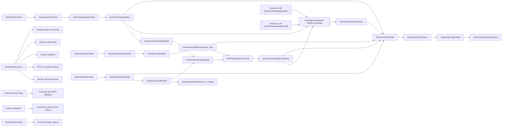

# Architecture Overview

## ROS 1 Noetic Architecture
This project uses ROS 1 Noetic with `rospy`, `std_msgs/String`, `std_srvs/Trigger`, XML launch files, a Click-based operations CLI, and pure Python helper logic. Messages are JSON strings so the project stays beginner-friendly and easy to test without a running ROS master.

## Validation Layer
The final project also includes a validation layer built around:

- `pytest` scenario tests for pure logic and message JSON
- launch validation that checks `warehouse_demo.launch`
- Gazebo launch validation that checks `gazebo_warehouse.launch`
- project structure validation
- ROS bag helper scripts for final demo recording, replay, and inspection

## CLI Operations Layer
`SmartWarehouseCLI` is the operator-facing Click interface for the project. It:

- creates sample JSON objects for tasks, navigation, safety, battery, package, status, and diagnostics
- prints ROS 1 commands for build, launch, topics, services, and rosbag usage
- validates project structure and ROS 1 compatibility
- generates demo scenarios for normal, emergency-stop, and low-battery flows
- prints rosbag helper commands for final recording

The CLI does not replace the ROS nodes. It supports demonstration, testing, and operations around the ROS pipeline.

## Nodes
Implemented ROS 1 nodes:

- `TaskPublisherNode`
  - publishes new task JSON on `/warehouse/tasks/new`
- `TaskQueueManagerNode`
  - subscribes to tasks, manages queue state, and publishes `/warehouse/tasks/status`
- `WaypointGoalPublisherNode`
  - converts started-task events into navigation goals on `/warehouse/navigation/goal`
- `PathProgressMonitorNode`
  - simulates progress and publishes `/warehouse/navigation/progress`
- `ObstacleDetectorNode`
  - simulates obstacle readings on `/warehouse/safety/obstacle`
- `EmergencyStopNode`
  - turns obstacle readings into emergency-stop commands on `/warehouse/safety/emergency_stop`
- `BatteryPublisherNode`
  - simulates battery state and publishes `/warehouse/battery/state`
- `ChargingControllerNode`
  - reacts to low battery and publishes `/warehouse/battery/return_to_charge` plus charge navigation goals
- `PackageHandlerNode`
  - provides package pickup and dropoff services and publishes `/warehouse/package/status`
- `StatusPublisherNode`
  - aggregates robot state and publishes `/warehouse/robot/status`
- `DiagnosticLoggerNode`
  - subscribes to robot status and publishes `/warehouse/robot/diagnostics`

## Communication Style
All topic payloads use `std_msgs/String` with JSON bodies. Package pickup, dropoff, and reset operations use `std_srvs/Trigger`. This avoids custom message setup for now and keeps pytest validation simple.

## Launch and Recording
- Main launch file: `launch/warehouse_demo.launch`
- Gazebo launch file: `launch/gazebo_warehouse.launch`
- Standalone Gazebo visualization script: `scripts/run_gazebo_visualization.sh`
- Launch system: ROS 1 XML via `roslaunch`
- Recording system: `rosbag record`, `rosbag play`, `rosbag info`
- Main demo bag now includes task, navigation, safety, battery, package, status, and diagnostics topics

## Topic Flow

## Implemented Member Flows
Member 1 Task Management:
- `TaskPublisherNode` publishes task JSON
- `TaskQueueManagerNode` queues, starts, and completes tasks

Member 2 Navigation:
- `WaypointGoalPublisherNode` creates navigation goals from task status
- `PathProgressMonitorNode` simulates movement progress

Member 3 Obstacle Safety:
- `ObstacleDetectorNode` simulates obstacle readings
- `EmergencyStopNode` publishes emergency stop commands
- `PathProgressMonitorNode` listens to active emergency-stop commands and blocks navigation when needed

Member 4 Battery System:
- `BatteryPublisherNode` simulates battery drain and charging
- `ChargingControllerNode` detects low battery and issues return-to-charge commands
- `ChargingControllerNode` also publishes a navigation goal to the charging station

Member 5 Package Handling:
- `PackageHandlerNode` prepares package state from started tasks
- `PackageHandlerNode` watches navigation progress to log pickup and dropoff readiness
- `PackageHandlerNode` exposes pickup and dropoff services and publishes package status events

Member 6 Robot Status + Diagnostics:
- `StatusPublisherNode` aggregates task, navigation, safety, battery, and package signals into one robot snapshot
- `DiagnosticLoggerNode` converts status snapshots into diagnostic events for warnings, errors, and critical states

Member 7 Advanced CLI + Operations:
- `SmartWarehouseCLI` provides structured operations commands, scenarios, validation, and helper output
- the CLI improves the demonstration workflow without requiring ROS for pure JSON and summary commands

Member 8 Testing + Recording:
- pytest scenario tests validate full happy path, emergency stop, low battery, package delivery, and status diagnostics flows
- launch validation and ROS 1 compatibility checks help keep the final submission clean
- rosbag scripts support final demo recording, replay, and inspection

## Future Expansion
All eight coding member areas are now implemented. Remaining work is presentation, demo preparation, and submission packaging.
